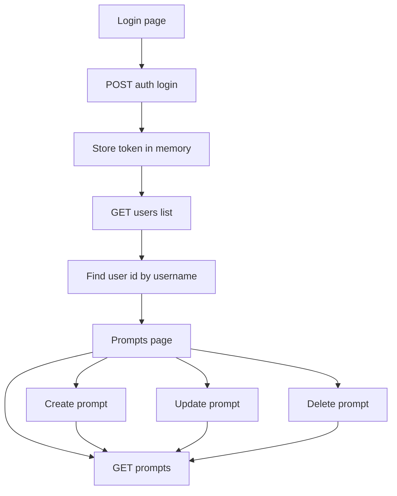

# Frontend v1 Plan

## 1. Scope and principles

- Scope: login plus prompts CRUD only
- Stack: React plus TypeScript plus Vite
- UI style: minimal, light and dark themes, neutral palette, medium spacing, tiny hover transitions
- Maintainability rule: small reusable components and clear separation between ui, domain, and infra
- Auth rule: JWT only in memory, full reload requires login again
- Prompt ownership rule: after login call users endpoint, match username, cache user id in memory

## 2. API contract mapping

Base prefix from backend:
- `/api/v1/auth/login`
- `/api/v1/users`
- `/api/v1/prompts`

### Lightweight contract table with examples

| Endpoint | Method | Auth | Request example | Response example | Frontend notes |
|---|---|---|---|---|---|
| `/api/v1/auth/login` | POST | No | `{ "username": "demo", "password": "secret" }` | `{ "access_token": "jwt-token", "token_type": "bearer" }` | Decode JWT subject to get username |
| `/api/v1/users?skip=0&limit=10` | GET | Yes | none | `[{ "id": 1, "username": "demo", "name": "demo", "last_name": "user", "phone": 1234567890, "email": "demo@mail.com" }]` | Resolve `user_id` by matching `username` |
| `/api/v1/prompts?skip=0&limit=10` | GET | Yes | none | `[{ "id": 7, "user_id": 1, "model_name": "gpt-4", "prompt_text": "Summarize text", "category": "work", "rate": "5" }]` | Treat 404 detail `No prompts found` as empty state |
| `/api/v1/prompts` | POST | Yes | `{ "user_id": 1, "model_name": "gpt-4", "prompt_text": "Summarize text", "category": "work", "rate": "5" }` | `{ "id": 7, "user_id": 1, "model_name": "gpt-4", "prompt_text": "Summarize text", "category": "work", "rate": "5" }` | Use cached in-memory `user_id` |
| `/api/v1/prompts/7` | PUT | Yes | `{ "user_id": 1, "model_name": "gpt-4.1", "prompt_text": "Summarize text in bullets", "category": "work", "rate": "5" }` | `{ "id": 7, "user_id": 1, "model_name": "gpt-4.1", "prompt_text": "Summarize text in bullets", "category": "work", "rate": "5" }` | Full object update in v1 |
| `/api/v1/prompts/7` | DELETE | Yes | none | deleted prompt object | Confirm via modal before delete |

### Auth
- POST `/api/v1/auth/login`
  - request: `{ username, password }`
  - response: `{ access_token, token_type }`

### Users
- GET `/api/v1/users`
  - auth required
  - frontend usage: find `user.id` where `user.username` equals logged username from JWT subject

### Prompts
- GET `/api/v1/prompts?skip=0&limit=10`
- POST `/api/v1/prompts`
- PUT `/api/v1/prompts/{prompt_id}`
- DELETE `/api/v1/prompts/{prompt_id}`

Prompt payload:
- `{ user_id, model_name, prompt_text, category, rate }`

## 3. Information architecture and routes

- `/login` public route
- `/app/prompts` protected route
- Fallback route redirects to `/login`

Route guards:
- if no token in memory redirect to `/login`
- if token exists but user id unresolved, resolve via users endpoint before entering prompts screen

## 4. Project structure

```text
frontend/
  src/
    app/
      router.tsx
      providers.tsx
    pages/
      login/
        login-page.tsx
      prompts/
        prompts-page.tsx
    components/
      ui/
        button.tsx
        input.tsx
        card.tsx
        badge.tsx
        modal.tsx
        table.tsx
        empty-state.tsx
        inline-error.tsx
      layout/
        app-shell.tsx
        topbar.tsx
      prompts/
        prompt-form.tsx
        prompt-list.tsx
        prompt-row-actions.tsx
    features/
      auth/
        auth-store.ts
        auth-service.ts
        auth-types.ts
      prompts/
        prompts-service.ts
        prompts-types.ts
        prompts-mappers.ts
    lib/
      http/
        api-client.ts
        api-error.ts
      validation/
        auth-schemas.ts
        prompt-schemas.ts
      utils/
        jwt.ts
        theme.ts
    styles/
      tokens.css
      base.css
      themes.css
```

## 5. Reusable design system minimal set

### Tokens in css custom properties

- color tokens
  - bg, surface, text, muted, border, accent, danger, success
- spacing tokens
  - 4, 8, 12, 16, 24, 32
- radius tokens
  - 6, 10
- typography tokens
  - font sizes for sm, md, lg
- motion tokens
  - hover transition only for color and border around 120ms

### Component behavior rules

- Button variants: primary, ghost, danger
- Input with label and error slot
- Table for prompts list with responsive collapse to cards on small screens
- Modal only for delete confirmation
- Empty state with one clear action
- Inline error for API failures and field validation errors

Accessibility baseline:
- semantic landmarks and heading order
- keyboard focus visible in both themes
- color contrast AA target
- form labels always explicit

## 6. State and data flow

State approach:
- React context plus reducer for auth session
- TanStack Query for prompts CRUD and server cache

Auth session in memory:
- token
- username from JWT subject
- resolved user id

Data rules:
- all server data through typed services
- no direct fetch in page components
- mappers isolate backend shape from ui shape
- query keys stable and feature scoped

## 7. Error handling and validation

Validation:
- zod schemas for login and prompt form
- map server errors to user friendly messages

Error layers:
- transport error from api client
- domain error from services
- ui message from page or form

Empty and loading states:
- skeleton for table area
- explicit empty state when no prompts
- retry action for recoverable failures

## 8. Prompt workflows



## 9. Open source quality practices

- Tooling
  - eslint with typescript and react hooks rules
  - prettier for formatting
  - editorconfig for stable whitespace
- Git hygiene
  - conventional commits
  - small pull requests by feature slice
- Testing
  - vitest for unit tests
  - react testing library for component behavior
  - msw for API mocks in tests
- CI
  - run typecheck, lint, tests, and build on pull requests
  - fail fast if coverage drops below agreed threshold

## 10. Implementation phases

1. Scaffold React TypeScript Vite app and base tooling
2. Add app router, providers, theme tokens, and base reusable ui components
3. Implement auth feature with in-memory store and login page
4. Implement user id resolution from users endpoint after login
5. Implement prompts list and CRUD with query cache and optimistic UI where safe
6. Add accessibility pass and responsive pass
7. Add tests for services, auth flow, and prompts interactions
8. Integrate CI checks and docs for local run

## 11. Definition of done for v1

- Login works and protects prompts route
- Prompt CRUD works for resolved logged user id
- Light and dark themes switch correctly
- Components reused across pages with no duplicated logic
- Lint, typecheck, tests, and build pass
- README section documents setup, scripts, and architecture choices

## 12. Known backend constraints for frontend

- `GET /api/v1/users` returns all users and frontend filters by username
- prompts endpoint may return 404 when no prompts, ui should treat this as empty state
- no refresh token flow in v1 by design
- no dedicated current user endpoint returning id in v1 flow

## 13. Suggested later improvements after v1

- add backend endpoint for current user with id to remove users list lookup
- add pagination controls in prompts list
- add sort and filter for category and model name
- add signup and password recovery screens
- move from in-memory token to short-lived token plus refresh strategy if needed
